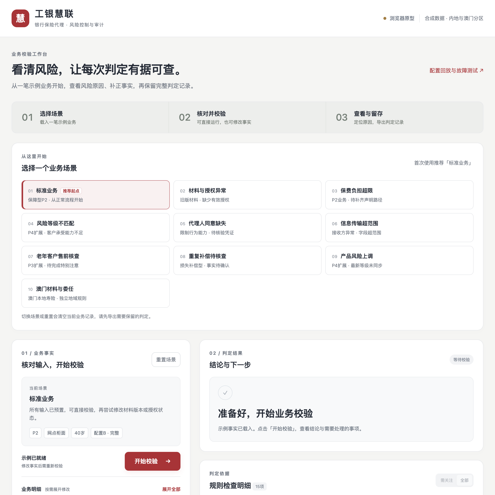
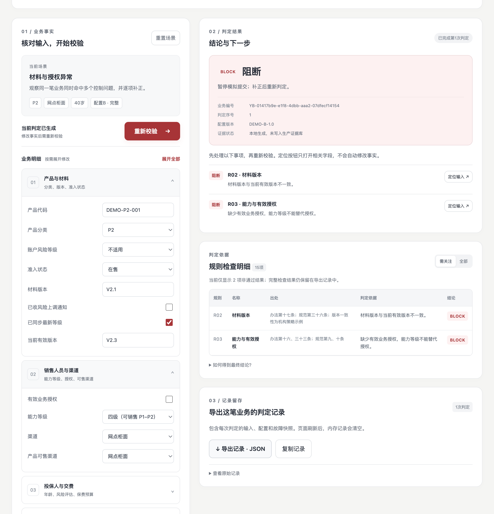

# 工银慧联 · 银行保险代理操作风险智能防控与审计平台

> 把银行代理保险业务中分散的控制点，收束为四个可执行的问题：**卖错了吗、越权了吗、传错了吗、查得到吗。**

[](https://yyybbb22.github.io/ICBC-Huilian/)
[](./index.html)
[](./docs/01-规则清单.md)
[](./LICENSE)

**在线演示：** <https://yyybbb22.github.io/ICBC-Huilian/>
**源码仓库：** <https://github.com/yyybbb22/ICBC-Huilian>
**赛事：** 第十七届"工行杯"金融科技创新大赛 · 金融安全服务赛道

---

## 界面预览

| 工作台入口：9 个风险场景 | 判定结果：事实、依据与证据三合一 |
| --- | --- |
|  |  |

上图取自线上演示环境：选择「02 材料与授权异常」并执行校验后，`R02 材料版本` 与 `R03 能力与有效授权` 同时命中 `BLOCK`，
判定面板给出阻断结论、业务编号、判定序号、配置版本与证据状态，规则明细中逐条标注**出处**与**判定依据**。

---

## 一、项目定位

工银慧联面向**银行代理销售保险**业务，是一个**与银保通协同的操作风险控制与审计增强层**。

它不替代核心生产系统，而是补上跨系统之间的一个缺口：
**在一笔业务操作发生的当时，回答四个问题，并把每次判断的规则版本、依据和人工痕迹一起留存下来。**

| 四道防线 | 模块 | 回答的问题 |
| --- | --- | --- |
| 第一道 | `PolicyPassport` | **卖错了吗** —— 产品有效版本、准入渠道、客户适当性要素是否同时成立 |
| 第二道 | `ServiceRouter` | **越权了吗** —— 岗位、机构、渠道、产品、动作是否在代理权限内 |
| 第三道 | `CaseBridge` | **传错了吗** —— 处理目的、客户授权、字段范围、接收方是否最小必要 |
| 第四道 | `EvidenceHub` | **查得到吗** —— 当时有效的规则、材料版本、判定结果能否被关联与复核 |

合作治理侧由 `InsurerGate`（机构与产品准入资料归集校验）与 `EqualBench`（跨渠道一致性比较）支撑，整体为 **"2 + 4 + 1"** 结构。

---

## 二、真实场景与问题定义

一笔银保业务在网点发生，经办人员需要同时确认四件事：当前展示和签署的材料是不是有效版本、客户是否适配这款产品、自己是否有权卖、传输出去的字段是否最小必要。

现实中这些约束分散在多份制度、多个系统与多个人之间，导致：

| 环节 | 现状痛点 |
| --- | --- |
| 规则分散 | 条款分散在多个监管文件与行内制度中，一线难以逐条对照执行 |
| 判定靠人 | 「能不能卖」高度依赖个人经验，同一笔业务不同人可能给出不同结论 |
| 阻断滞后 | 多数控制点落在**事后**质检或回访阶段，问题业务已经完成 |
| 证据易失 | 判定过程没有结构化留存，检查时难以还原「当时为什么通过」 |
| 责任模糊 | 出现争议时无法区分是「规则没配」「授权未开」还是「明知故犯」 |

**根因不是缺少制度，而是制度条文与操作时点之间缺少可执行、可留痕的连接。**

---

## 三、2026 年制度背景

项目卡在一个明确的时间窗口上——适当性要求在 2026 年被系统性收紧，但机构适配进度并不一致。

| 依据 | 发布 / 施行 | 与本项目的关系 |
| --- | --- | --- |
| 《金融机构产品适当性管理办法》 | 2025-07-11 发布 / 2026-02-01 施行 | 统一银行、保险等产品的适当性管理要求 |
| 《保险产品适当性管理自律规范》（中国保险行业协会） | 2026-03-27 发布 / 2026-07-01 施行 | 提出系统化落实要求，本项目规则的直接来源之一 |
| 《商业银行代理销售业务管理办法》 | 2025-03-21 发布 / 2025-10-01 施行 | 合作机构管理、产品准入、销售过程管控 |
| 《保险销售行为管理办法》 | 2023-09-20 发布 / 2024-03-01 施行 | 销售行为与可回溯管理 |
| 《中华人民共和国个人信息保护法》 | 2021-08-20 | 处理目的、最小必要字段、接收方与同意状态 |
| 《银保通系统接口规范》（JR/T 0324.1–4—2025） | 2025-09-29 发布并实施 | **行业标准**，规定接口数据元与报文，不规定银行内部管理流程 |

完整清单与逐条对应关系见 [`docs/01-规则清单.md`](./docs/01-规则清单.md)。

> 《银保通系统接口规范》约束的是**接口层**，不代表银保通本身缺少风控能力。本项目定位为**增强层**，复用其权威状态，只在确有跨系统缺口的环节提供独立校验与证据关联。

---

## 四、可执行规则集与处置分档

平台提供三种接入方式：**旁路核查**（读取状态、生成差异报告）、**提交前同步校验**（返回结论，由业务决定是否提交）、以及**留痕回写**。

### 处置分档的依据是判定性质，不是产品类别

| 判定 | 含义 | 系统行为 |
| --- | --- | --- |
| `BLOCK` | 阻断 | 禁止进入模拟提交，需补正事实后重新判定 |
| `MANUAL` | 转人工 | 事实未核实或服务不可用，交由有权岗位处理 |
| `COND` | 条件已满足 | 替代路径要素齐备，仍需生产系统复核真实凭证 |
| `NOTICE` | 提示并留痕 | 允许继续，但必须保留告知与回访痕迹 |
| `PASS` | 通过 | 满足本演示控制条件 |

汇总优先级：`BLOCK` → `MANUAL` → `COND` → `NOTICE` → `PASS`（取最严者）。
**任何 `BLOCK` 未解除时，其余规则的 `PASS` 不产生放行效果。**

### 15 条示例规则

| 编号 | 规则名称 | 适用范围 |
| --- | --- | --- |
| `R01` | 产品准入状态 | 全部 |
| `R02` | 材料版本 | 全部 |
| `R03` | 能力与有效授权 | 全部 |
| `R04` | 渠道范围 | 全部 |
| `R05` | 评估有效性 | P4、P5 |
| `R06` | 风险匹配与替代路径 | P4、P5 |
| `R07` | 财务支付与投保声明 | P2至P5 |
| `R08` | 需求与重复补偿核查 | 需求评估适用产品及损失补偿型 |
| `R09` | 民事行为能力 | 全部 |
| `R10` | 老年投保人特别注意 | 65周岁及以上且P3至P5 |
| `R11` | 评估顺序与频次 | 适用评估的销售；频次仅P4、P5 |
| `R12` | 传输范围与接收方 | 本演示以同意为处理依据 |
| `R13` | 分级信息完整性 | 全部；R等级仅P4、P5 |
| `R14` | 风险变更同步 | P4、P5 |
| `R15` | 证据写入模拟 | 全部 |

每条规则均带 **「人工复核要求」** 与 **「应留存证据」** 元数据——
**规则不替代人工，而是明确人工该看什么、留什么。**
人工岗位可以核验事实、纠正配置、执行有依据的替代路径，但**不得任意豁免禁止性规则**。

> 这 15 项是演示规则目录，区分制度依据、机构策略与模拟状态，**不是全部法规义务**。未命中不等于合规。

### 控制层自身失效时怎么办

控制层若不能正确处理自身故障，它就会变成新的风险源。本项目约定：

| 故障 | 降级行为 |
| --- | --- |
| 规则服务超时 | **不执行任何规则**，返回 `MANUAL`，而非当作「没命中＝通过」 |
| 版本库不可用 | 材料版本规则转 `MANUAL`，等待恢复后核验 |
| 证据写入失败 | 保留本地诊断记录，但**不标记**业务证据写入成功 |

---

## 五、技术实现要点

| 能力 | 实现方式 |
| --- | --- |
| 规则引擎与 UI 解耦 | `js/rules-engine.js` 为**零 DOM 依赖**纯逻辑模块，可独立单测与回归验证 |
| 确定性判定 | 同一输入 + 同一配置 + 同一故障状态 ⇒ 恒定结论 |
| 配置版本化 | 判定记录冻结 `config_id`，支持 `DEMO-A-1.0` / `DEMO-B-1.0` 对比回放与差异比对 |
| 输入快照 | 每次判定冻结输入，历史结论不因表单后续改动而失真 |
| 输入防御 | 类型、范围、逻辑一致性校验不通过时**不执行规则引擎** |
| 结构化留痕 | 导出含业务编号、判定 ID、时间、配置、故障快照的完整证据包 JSON |
| 无障碍 | 语义化结构、键盘可达、`aria-pressed` / `aria-live`、跳转链接、焦点可见 |

全部逻辑在浏览器内存运行，**无后端、无第三方依赖、无网络请求**，便于评委离线复核。

---

## 六、本地运行

```bash
git clone https://github.com/yyybbb22/ICBC-Huilian.git
cd ICBC-Huilian
open index.html          # macOS
# 或：python3 -m http.server 8000  →  http://localhost:8000
```

零构建、零依赖，双击 `index.html` 即可使用。

---

## 七、推荐的演示路径（约 5 分钟）

1. **场景 1「标准业务」** → 点击「开始校验」→ 得到 `PASS`，建立正常基线
2. **场景 2「旧版材料与销售越权」** → 同时命中 `R02`、`R03` 两条 `BLOCK`
3. **点「定位输入 ↗」** → 自动展开并聚焦到对应字段，演示补正闭环
4. **场景 6「信息传输超范围」** → `R12` 阻断，展示个人信息保护维度
5. **展开「进阶演示」** → 切换到「配置 A」→ 对比回放，展示差异比对与责任边界
6. **注入「证据写入失败」** → 恢复 → 展示判定历史与故障追溯

详细话术见 [`docs/02-演示脚本.md`](./docs/02-演示脚本.md)。

---

## 八、当前交付边界（重要）

答辩与阅读时请以本节为准——**已实现**与**设计中**必须分开陈述。

### 已实现（本仓库可运行验证）

- 离线 HTML 最小闭环：15 条示例规则的判定、分档汇总与证据导出
- 9 个风险场景、2 套规则配置的对比回放
- 3 类故障注入与降级恢复
- 规则与 UI 分层，规则引擎可独立回归验证
- 结构化规则元数据（法源 / 适用范围 / 人工权限 / 应留证据）

### 设计中（尚未集成进本演示）

- `InsurerGate`、`EqualBench` 合作治理模块（`InsurerGate V2` 曾独立演示，**未与本次 HTML 闭环集成**）
- `ServiceRouter` 的机构—岗位权限映射
- `CaseBridge` 的信息流转单
- `EvidenceHub` 的证据链持久化、签名与防篡改
- 银保通三种接入方式的实际联调

> 设计说明不等于实测成果。本仓库涉及的验收指标均为**目标值**，不是已完成的实测结论。

---

## 九、目录结构

```text
ICBC-Huilian/
├── index.html                        # 演示主页面（零构建，可直接打开）
├── css/
│   └── main.css                      # 样式：品牌色 + 响应式 + 无障碍
├── js/
│   ├── rules-engine.js               # 规则引擎内核（纯逻辑，无 DOM 依赖）
│   ├── app.js                        # 应用层：表单读写、判定渲染、会话管理
│   └── ui.js                         # 展示层：场景卡片、引导说明、筛选与定位
├── assets/
│   ├── demo-data/
│   │   ├── rule-catalog.json         # 15 条规则的元数据清单
│   │   └── scenario-baseline.json    # 9 个场景的判定基线（可作回归基线）
│   └── images/
│       ├── screenshot-01-overview.png    # 工作台入口
│       └── screenshot-02-verdict.png     # 判定结果与规则明细
├── docs/
│   ├── 01-规则清单.md
│   ├── 02-演示脚本.md
│   ├── 03-数据来源与免责声明.md
│   └── ARCHITECTURE.md
├── README.md
└── LICENSE
```

---

## 十、数据来源

- **全部业务数据为合成示例数据**，字段命名参考公开监管文件中的分类口径（产品类别 P1–P5、风险等级 R1–R5、客户承受能力 C1–C5）。
- 产品代码统一带 `DEMO` 前缀，避免与真实产品混淆。
- 规则条款出处为**公开发布的监管规定与自律规范**，逐条对应见 [`docs/01-规则清单.md`](./docs/01-规则清单.md)。
- 监管要求中由机构自行确定的部分（如产品上架渠道、事件触发机制）明确标注为 **「机构策略示例」**，不冒充为监管强制要求。
- 建议采用的测试数据由四类构成：公开监管与银行制度、脱敏产品及宣传材料、合成人员与岗位权限、以及经许可的去标识样例。

---

## 十一、免责声明

- 本项目是**学生竞赛场景下的教学演示原型**，不是真实银行上线系统，未接入任何生产数据源或核心系统。
- 所有勾选框仅用于模拟「已核验事实」，**不构成电子签名、身份认证或法律意义上的投保声明**。
- 导出的 JSON 证据包**不具备**数字签名、时间戳权威认证与防篡改能力，仅为结构演示。
- 项目所用名称、界面与流程若与任何企业名称、产品名称相同或近似，**仅为说明业务场景用途，不代表该企业或机构的正式产品、认可、背书或合作关系**。
- 禁止性事实不得通过任何书面声明予以覆盖；演示中的「替代路径」判定仅表示演示输入要素齐备，仍须由生产系统复核真实凭证。
- 本仓库为公开仓库，**不包含**任何真实客户数据、内部材料或个人信息。
- 更多说明见 [`docs/03-数据来源与免责声明.md`](./docs/03-数据来源与免责声明.md)。

---

## 许可证

[MIT License](./LICENSE) © ICBC-Huilian Contributors
